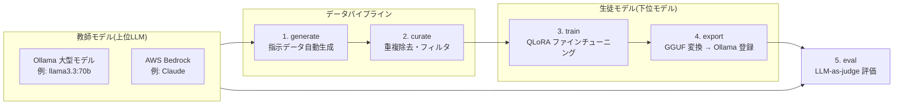

# LLM Instruction Learning Platform

上位LLM(教師モデル)と下位モデル(生徒モデル)を組み合わせて **指示学習(instruction tuning)** を行うためのプラットフォームです。AWS 上での運用を想定しています。

## 仕組み(知識蒸留パイプライン)



1. **generate** — シードタスクをもとに、教師モデルが Self-Instruct 方式で指示・応答ペアを大量生成します
2. **curate** — 類似度による重複除去と品質フィルタを行い、train/val に分割します
3. **train** — 生徒モデル(例: `Qwen/Qwen2.5-7B-Instruct` などの HF モデル)を QLoRA で学習します
4. **export** — 学習済みモデルを GGUF に変換し、Ollama にモデルとして登録します
5. **eval** — 生徒モデルの応答を教師モデルが採点し(LLM-as-judge)、レポートを出力します

## セットアップ

```bash
# コア(データ生成・評価のみ。GPU 不要)
pip install -e ".[dev]"

# 学習まで行う場合(GPU 必須)
pip install -e ".[train]"

# Bedrock を教師に使う場合
pip install -e ".[aws]"
```

Ollama はローカルまたは GPU インスタンス上で起動しておきます:

```bash
ollama serve
ollama pull llama3.3:70b   # 教師モデルの例
```

## 使い方

すべて `itl` CLI から操作します。設定は `config/default.yaml` を参照してください。

```bash
# 1. 指示データを生成(教師モデルを呼び出す)
itl generate --config config/default.yaml

# 2. データのキュレーション(重複除去 → train/val 分割)
itl curate --config config/default.yaml

# 3. QLoRA 学習(GPU 環境で実行)
itl train --config config/default.yaml

# 4. GGUF 変換と Ollama への登録
itl export --config config/default.yaml

# 5. 教師モデルによる自動評価
itl eval --config config/default.yaml
```

## AWS 構成

`infra/terraform/` に最小構成の Terraform があります:

- **S3** — データセット・チェックポイント・評価レポートの保管
- **ECR** — パイプラインのコンテナイメージ
- **EC2 (GPU)** — Ollama サーバー + 学習ジョブ実行(`g5.2xlarge` など)

```bash
cd infra/terraform
terraform init
terraform apply -var="project_name=llm-itl"
```

構成の詳細・SageMaker を使う場合の比較は [docs/architecture.md](docs/architecture.md) を参照してください。

## ディレクトリ構成

```
├── config/default.yaml      # パイプライン設定(教師/生徒/学習/評価)
├── src/itl/
│   ├── teachers/            # 教師モデルクライアント(Ollama / Bedrock)
│   ├── generation/          # 指示データ生成・キュレーション
│   ├── training/            # QLoRA 学習・GGUF エクスポート
│   ├── evaluation/          # LLM-as-judge 評価
│   └── cli.py               # itl コマンド
├── data/seed_tasks.jsonl    # シードタスク(生成の種)
├── infra/terraform/         # AWS インフラ定義
├── docker/                  # コンテナイメージ
└── tests/
```
