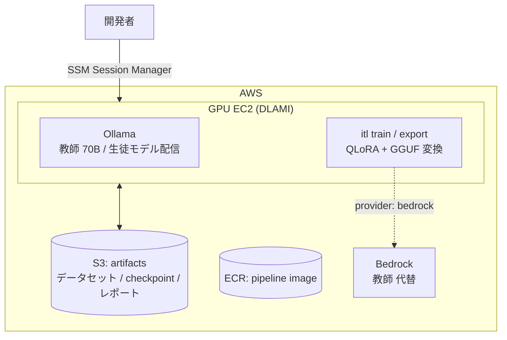

# アーキテクチャ

## 全体像

このプラットフォームは「上位LLM(教師)が作ったデータで下位モデル(生徒)を鍛える」知識蒸留型の指示学習パイプラインです。5つのステージで構成され、それぞれ `itl` CLI のサブコマンドに対応します。

| ステージ | コマンド | 実行環境 | 使用モデル |
|---|---|---|---|
| データ生成 | `itl generate` | CPU で可(教師への API 呼び出しのみ) | 教師 |
| キュレーション | `itl curate` | CPU | なし |
| 学習 (QLoRA) | `itl train` | GPU 必須 | 生徒 |
| エクスポート | `itl export` | GPU 推奨 | 生徒 |
| 評価 | `itl eval` | CPU で可 | 教師 + 生徒 |

## 教師モデルの選択肢

`config/default.yaml` の `teacher.provider` で切り替えます。

### 1. Ollama(セルフホスト大型モデル)
- 例: `llama3.3:70b`, `qwen2.5:72b`
- 利点: トークン課金なし、データが外に出ない、出力のライセンス制約を管理しやすい
- 欠点: 70B 級には `g5.12xlarge`(A10G×4)以上が必要でインスタンス費用が高い
- 補足: 生成データで別モデルを学習する場合、教師モデルのライセンス(Llama 3.3 Community License 等)の蒸留条項を確認すること

### 2. AWS Bedrock(マネージド上位モデル)
- 例: Claude Sonnet / Opus
- 利点: GPU 不要で最高品質の教師データ、従量課金でスモールスタート可能
- 欠点: トークン課金、プロバイダの利用規約(出力を競合モデルの学習に使う場合の条項)を確認する必要あり

## AWS 構成(infra/terraform)



- **S3** — 生成データ・キュレーション済みデータ・チェックポイント・GGUF・評価レポートを保管(バージョニング有効)
- **ECR** — `docker/Dockerfile` でビルドした軽量パイプラインイメージ(生成・評価用)
- **GPU EC2** — AWS Deep Learning AMI(PyTorch)ベース。user_data で Ollama を自動インストール。接続は SSM Session Manager 推奨(SSH は既定で全拒否)
- **IAM** — インスタンスロールに S3 読み書きと SSM のみ。Bedrock 教師を使う場合は `enable_bedrock_teacher=true` で推論権限を追加

### インスタンスサイズの目安

| 用途 | 推奨タイプ | 備考 |
|---|---|---|
| 生徒 1.5B〜7B の QLoRA 学習 | `g5.2xlarge` (A10G 24GB) | 7B は max_seq_length を要調整 |
| 生徒 7B〜14B の QLoRA 学習 | `g5.12xlarge` / `g6e.2xlarge` | |
| 教師 70B を Ollama で稼働 | `g5.12xlarge` 以上 / `g6e.12xlarge` | q4 量子化で ~40GB VRAM |

コスト最適化: 学習ジョブはスポットインスタンス化、教師は使うときだけ起動(`gpu_instance_count=0` で停止)、または教師だけ Bedrock にして GPU を学習専用の小さいインスタンスにする構成が安価です。

### SageMaker を使う場合

本リポジトリは素の EC2 を前提にしていますが、以下の場合は SageMaker Training Jobs への移行を検討してください:

- 学習ジョブをキューイング・並列実行したい(ハイパーパラメータ探索など)
- スポット中断からの自動再開・実験管理(MLflow / Experiments)が欲しい

`itl train` はただの Python エントリポイントなので、`docker/Dockerfile` に `[train]` extras を足したイメージをそのまま SageMaker の学習コンテナとして使えます。

## データフォーマット

全ステージ共通で JSONL(1行1レコード)を使います:

```json
{"instruction": "指示文", "input": "付随する入力(なければ空文字)", "output": "模範解答"}
```

学習時には chat 形式(`messages` 配列)に変換され、各モデルの chat template が適用されます(`src/itl/training/train_qlora.py` の `build_chat_records`)。

## 拡張ポイント

- **教師バックエンドの追加** — `itl.teachers.base.TeacherClient` を実装し、`create_teacher` に分岐を足すだけ(OpenAI 互換 API、vLLM など)
- **キュレーションの強化** — 現在は ROUGE-L 風類似度の重複除去。埋め込みベースの意味的重複除去や、教師モデルによる品質スコアリングを `curate.py` に追加可能
- **DPO / 選好学習** — 教師に複数候補を生成させ選好ペアを作れば、SFT 後の DPO ステージを追加できる(trl の `DPOTrainer`)
